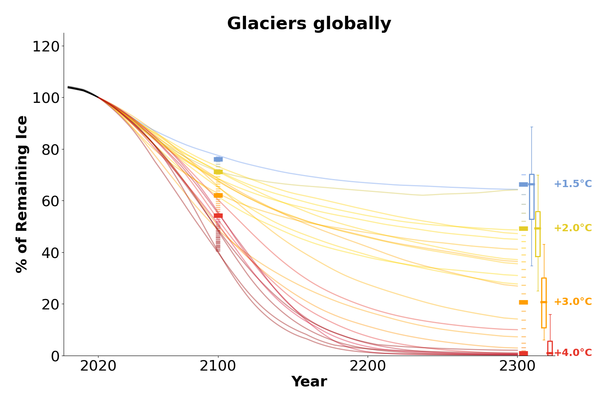

# Glacier model projections of CMIP5 and CMIP6 GCMs until 2300

Global and per RGI region aggregated glacier volume projections of three glacier models using all to us available GCMs until 2300 from CMIP5 and CMIP6. 

||
|:--:| 
||
|:--:| 
| *Figure 1: Global mean temperature changes of used CMIP6 and CMIP5 GCMs until 22300. For reference, the grey lines, represent the gcm ensemble until 2100.* |

The three glacier models are:

- PyGEM-OGGM [(model similar as in Rounce et al, 2023)](https://doi.org/10.1126/science.abo1324) : CMIP5 and CMIP6
- OGGM [(exact same files as the OGGM standard projection files v1.6.1)](https://zenodo.org/records/8286065) : CMIP5 and CMIP6
- GloGEM ([model similar as in Huss and Hock, 2015](https://doi.org/10.3389/feart.2015.00054); but e.g. with glacier-per glacier calibration using [Hugonnet et al., 2021](https://doi.org/10.1038/s41586-021-03436-z)) : only CMIP6, one SSP534-over GCM is missing

We have saved the aggregated output in csv-files in subfolders inside of [glacier_model_csv_files/](glacier_model_csv_files/) for every RGI region or globally. In every csv file, all GCM projections from one scenario (e.g. `ssp370.csv`) are given as different columns, where each of the rows shows one year from 2000 until 2300 (2000 means glacier state from January 1st 2000). Attention, some of the GCM names in some glacier models have only upper letters. The folder structure is the following: `{glac_model}/{var}/{cmip}/{year}/RGI{id}/{scenario}.csv`
- {glac_model} is the glacier model, e.g. GloGEM
- {var} is volume in m3 (area will be added soon)
- {cmip} is CMIP5 or CMIP6
- {year} is 2100 or 2300
- RGI{id} is e.g. RGI01 or global
- {scenario} is e.g. ssp585 or rcp45

Note that we have excluded connectivity level 2 glaciers in RGI region 05 (same as e.g. in GlacierMIP3) and each model has used its current "default" model set-up. That means all models used RGI version 6,
matched the [Farinotti et al. (2019) ice thickness](https://doi.org/10.1038/s41561-019-0300-3) at least regionally, calibrated glacier-specifically their mass-balance model parameters using [Hugonnet et al. (2021)](https://doi.org/10.1038/s41586-021-03436-z) and did a GCM bias-correction.
In case of questions, please ask. 

----

If you use the data or the figures, please cite the dataset and the figures as following:
*XXX (2023). XXXX: v1.0 (v1.0). Zenodo. https://doi.org/XXX*

----

In the folder, [figures/]([figures/), you can find different figure drafts and additional analysis figures that have been created for the ICCI State of the Cryosphere report. All figures have been plotted by the [final_visualise_glacier_projections_until_2300_lowess_percentile_intervals.ipynb notebook](final_visualise_glacier_projections_until_2300_lowess_percentile_intervals.ipynb).

## Some details to understand the figures
#### submitted figures for the ICCI report: [figures/main_figures_with_uncertainties/median_glac_models](figures/main_figures_with_uncertainties/median_glac_models) 

||
|:--:| 
|*Figure 2: Global remaining glacier volume until 2300 relative to the year 2020. The colors of the lines describe the different global mean temperature changes (2071-2100 vs pre-industriel) of the experiments. Black lines denote the past evolution from 2000-2019. The thick horizontal lines give for different temperature levels the best estimates of remaining glacier ice in 2100 and 2300. The boxplots describe the uncertainties (median, 50%-ile range, 90%-ile range)*|

The figures for the different aggregated regions are in [figures/main_figures_with_uncertainties/median_glac_models](figures/main_figures_with_uncertainties/median_glac_models). 

**Longer description:**

- Colors describe the temperature change until 2100 (i.e. 2071-2100 average versus pre-industrial, as defined by IPCC). Note that the colorscale is continuous, i.e., if an experiment created a global temperature change of +1.8°C, the line of the projections is in the color in between +1.5°C and +2.0°C.
- Each line corresponds to the median 20-year centered rolling average projection from two to three large-scale glacier models (OGGM, PyGEM, GloGEM) and one of 24 climate experiments (using different emission scenarios and climate models from CMIP5 and CMIP6 that run until 2300). Thus, the 24 experiments are represented by 24 lines. OGGM and PyGEM have run projections for 24 experiments each, GloGEM for 12 experiments (i.e., only CMIP6). The climate experiments give global mean temperature changes of ~+1.4°C to ~+6.3°C until the year 2100. 
    - We did not include the projections from Marzeion et al. (2012) (projections that are shown inside of the ICCI report at the moment). The main reason is that they did not have access to the new glacier observation and climate data, so there is evidence that we can trust the new three models more. Excluding them also removes some outliers that we had when we included them. 
    - We excluded the SSP534-over scenarios for these figures, as they are too complex to include in the same figure. 
- The horizontal thick lines of the "columns" in 2100 / 2300 give the best estimates of the remaining glacier ice for different temperature levels of +1.5°C, +2.0°C, +3.0°C, +4.0°C  (the values were extracted by doing a temperature-dependent *lowess* fit over all individual experiments and glacier models, not over the median). The smaller horizontal lines give the fitted estimates for every tenth of a degree between the temperature level. The horizontal lines are thus the "legend" for the temperature changes of the experiments.
    - for the *lowess* best fit and to compute the bootstrapped percentile intervals for the uncertainties, we used the library [moepy](https://doi.org/10.5281/zenodo.4642896), details below
- Uncertainty estimates for each temperature level are shown by the boxplots on the right side (within the thick box, 50% of the values/distribution are inside, the thin line represents here 90 % of the distribution)

We give the figures in `png` and `svg` format. 

#### Some details on how we got the “best estimates” for different temperature levels 
Problem: GCMs until 2300 are not sampled around temperature levels

Idea: use any kind of fit to get the best estimate

Theoretical physical “constraints” of a fit:

- remaining ice should decrease with higher global temperatures
- remaining ice should be above/equal zero

In the folder [figures/appendix_fit/](figures/appendix_fit/), you can find the chosen fit together with the percentile interval of "remaining glacier ice vs global temperature change" for every region and for the years 2100 and 2300. These best estimates and uncertainties were used to get best estimates and uncertaintes for each temperature level that are shown in the main figures of above. 

We chose the fitting approach “lowess”:

- LOWESS means Locally Weighted Scatterplot Smoothing. We tuned the “frac” parameter (basically describing the fraction of data used for the smoothing) in a way to best match the physical constraints and expert knowledge. The percentile intervals, here 50%PI and 90%PI, have been computed by a bootstrap sampling approach using MOEPY, see the [MOEPY user guide](https://ayrtonb.github.io/Merit-Order-Effect/ug-08-lowess-quick-start/). Attention, we compute and show the percentile intervals, which are not the same as the confidence intervals, see e.g., https://seaborn.pydata.org/tutorial/error_bars.html) 
    - [Under the following link](figures/appendix_fracs/2300_lowess_fracs_oggm_glogem_pygem_temp_levels_global_v3_1.png), you can for example find the effect of the "frac" parameter on the global fitted remaining ice in 2300. 
    - The computation of the fits for every "frac" option was done by the python script [lowess_percentile_interval_fit_per_region.py](lowess_percentile_interval_fit_per_region.py), and was run on the OGGM cluster (using [slurm_lowess_percentile_interval.slurm](slurm_lowess_percentile_interval.slurm), as it takes quite long. The outcome is aggregated in the file [lowess_fit_stats_oct29_predi_all_it1.csv](lowess_fit_stats_oct29_predi_all_it1.csv), and is loaded when running the plotting notebook.
    - for some regions, we had to use expert knowledge (decided by Fabien Maussion and Lilian Schuster). In the folder [figures/appendix_fracs/](figures/appendix_fracs/), you can see the effect of the "frac" tuning parameters and we highlighted the chosen "frac" tuning parameter. Note, that we had to replace values below zero to zero in some cases. 

We have also tried / are trying the following approaches:

- option 1 “exp”
    - exponential decaying fit. Not perfect, but simple and complies to the physical constraints. However, we assume an “exponential decay of some order”, i.e., in +1.5°C predicted remaining ice is larger than for option 2. No uncertainty estimates so far, but there is a way to include similar uncertainties as in option 2. The exponential decay fits are also shown in the fitting figures of [figures/appendix_fit/](figures/appendix_fit/), but are not used anywhere else. 
- option 3: GPR emulator (not yet available, work in process):
    - We are working with Salma Barkauoi to use a more sophisticated approach (gaussian process regression fit emulators) that still complies with the physical constraints. These emulators might work for every single year, which would allow to draw a best estimate projection line with uncertainties for every temperature level (but this is still work in process). 

#### Other figure variants
- In [figures/main_figures_with_uncertainties/all_glac_models](figures/median_glac_models), we show a figure variant where no median over the glacier models is taken and instead every glacier model is shown individually as a line, i.e., there are 60 instead of 24 lines.  For the temperature-dependent fit, we still use the same approach as above.
- In [figures/main_figures_without_uncertainties/]([figures/main_figures_without_uncertainties/), we show a figure variant where the uncertainty estimates are not shown (no boxplots). 

