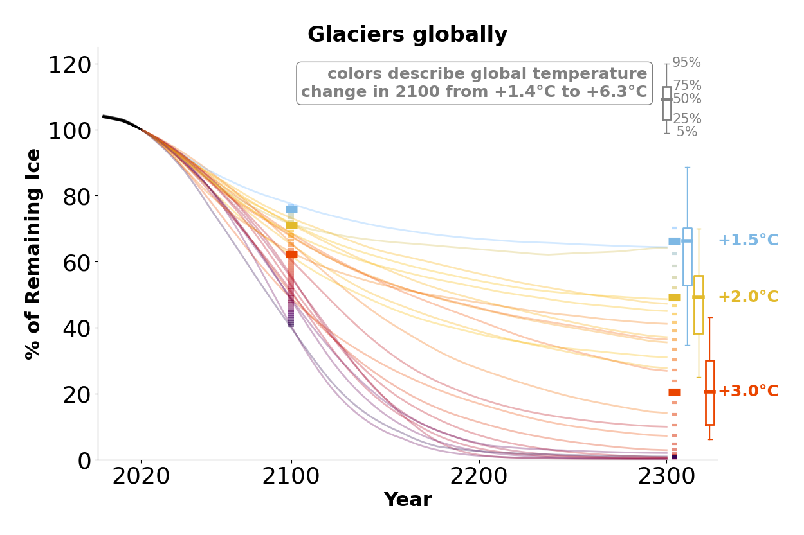

# Glacier model projections of CMIP5 and CMIP6 GCMs until 2300

Global and regionally aggregated glacier volume projections until 2300.

If you use the data or the figures, please cite the dataset and the figures as following:

*Schuster, L., Huss, M., Maussion, F., Rounce, D. R., & Tober, B. S. (2023). lilianschuster/glacier-model-projections-until2300: v1.0 [Dataset]. Zenodo. https://zenodo.org/doi/10.5281/zenodo.10055416*

In addition, please cite the individual glacier models: [PyGEM-OGGM, Rounce et al., 2023](https://doi.org/10.1126/science.abo1324), [OGGM, Maussion et al., 2019](https://doi.org/10.5194/gmd-12-909-2019), and [GloGEM, Huss and Hock, 2015](https://doi.org/10.3389/feart.2015.00054). We also recommend to refer to the CMIP option(s) that you are using.

## Figures

**Update: new simplified figures for the ICCI State of the Cryosphere report 2024 are in [v2024_figures](v2024_figures) and their simplified methods are described in [v2024_README.md](v2024_README.md). Below, the general methods and those methods specific to the 2023 version are described.**

In [v2023_figures]([v2023_figures/), you will find figures and additional analyses that were created for the ICCI State of the Cryosphere report 2023 in 

||
|:--:|
|*Figure 1: Global glacier volume until 2300, relative to 2020. The lines' colors correspond to the global temperature change (2071-2100 vs pre-industrial) of the respective climate model. Black lines denote the past evolution from 2000-2019. The thick horizontal scales overlaid in 2100 and 2300 indicate our best estimate of remaining glacier volume for each global temperature level in 2100. The boxplots indicate the uncertainties (median, 50%-ile range, 90%-ile range).*|

Code: [v2023_final_visualise_glacier_projections_until_2300_lowess_percentile_intervals.ipynb notebook](v2023_final_visualise_glacier_projections_until_2300_lowess_percentile_intervals.ipynb).

## Methods

### Glacier projections

We used three widely used and peer-reviewed large scale glacier models:

- PyGEM-OGGM [(version similar to Rounce et al, 2023)](https://doi.org/10.1126/science.abo1324) : CMIP5 and CMIP6
- OGGM v1.6.1 [(standard projection files v1.6.1)](https://zenodo.org/records/8286065) : CMIP5 and CMIP6
- GloGEM ([Huss and Hock, 2015](https://doi.org/10.3389/feart.2015.00054); but with some changes, e.g. with glacier-per glacier calibration using [Hugonnet et al., 2021](https://doi.org/10.1038/s41586-021-03436-z)) : only CMIP6 (one SSP534-over GCM is missing)

We forced the glacier models with GCMs from the CMIP5 and CMIP6 ensembles shown below:
 
||
|:--:| 
| *Figure 2: Global mean temperature changes of used CMIP5 and CMIP6 GCMs until 2300. For reference, additional GCMs going only until 2100 are shown aswell. The notebook to extract global mean temperatures and these figures is [here](https://nbviewer.org/urls/cluster.klima.uni-bremen.de/~oggm/oggm-standard-projections/analysis_notebooks/global_gcm_climate_cmip6_cmip5.ipynb). A list of the names of the used GCMs until 2300 is available under these links for [CMIP5](https://cluster.klima.uni-bremen.de/~oggm/cmip5-ng/gcm_table_2300.html) and [CMIP6](https://cluster.klima.uni-bremen.de/~oggm/cmip6/gcm_table_2300.html).* |

### Data processing: raw csv files

We have saved the aggregated output csv-files in subfolders ([glacier_model_csv_files/](glacier_model_csv_files/)) for each RGI region and globally. In the csv files, all GCM projections from one scenario (e.g. `ssp370.csv`) are given as different columns, where each row shows one year from 2000 until 2300 (2000 means glacier state from January 1st 2000). Attention: some GCM names in the csv files of some glacier models have only upper letters. The folder structure is the following: `{glac_model}/{var}/{cmip}/{year}/RGI{id}/{scenario}.csv`
- {glac_model} is the glacier model, e.g. GloGEM
- {var} is volume in m3 (area will be added soon)
- {cmip} is CMIP5 or CMIP6
- {year} is 2100 or 2300
- RGI{id} is e.g. RGI01 or global
- {scenario} is e.g. ssp585 or rcp45

Note that we have excluded connectivity level 2 glaciers in RGI region 05 (same as e.g. in GlacierMIP3), and each model has used its current (state: September 2023) "default" model set-up. That means all models used RGI version 6, matched the [Farinotti et al. (2019) ice thickness](https://doi.org/10.1038/s41561-019-0300-3) at least regionally, calibrated glacier-specifically their mass-balance model parameters using [Hugonnet et al. (2021)](https://doi.org/10.1038/s41586-021-03436-z) and did a GCM bias-correction. In case of questions, please ask. 

### Data processing: figures for the ICCI report
 [figures/main_figures_with_uncertainties/median_glac_models](figures/main_figures_with_uncertainties/median_glac_models)

All figures for the different aggregated regions are in [figures/main_figures_with_uncertainties/median_glac_models](figures/main_figures_with_uncertainties/median_glac_models). We give the figures in `png` and `svg` format.

**Longer figure description:**

- Colors describe the temperature change until 2100 (i.e. 2071-2100 average versus pre-industrial, as defined by IPCC). Note that the colorscale is continuous, i.e., if an experiment created a global temperature change of +1.8°C, the line of the projections is in a color in between +1.5°C and +2.0°C.
- Each line corresponds to the median 20-year centered rolling average projection from two to three large-scale glacier models (OGGM, PyGEM, GloGEM) and one of 24 climate experiments (using different emission scenarios and climate models from CMIP5 and CMIP6 that run until 2300). Thus, the 24 lines represent the 24 climate experiments. Note that OGGM and PyGEM have run projections for 24 experiments and GloGEM for 12 experiments (i.e., only CMIP6). The climate experiments give global mean temperature changes of ~+1.4°C to ~+6.3°C until the year 2100.
    - We did not include the projections from [Marzeion et al. (2012)](https://doi.org/10.5194/tc-6-1295-2012) (glacier projections that are shown in the ICCI State of the Cryosphere report from the year 2022 or earlier). The main reason is that they did not have access to the new glacier observation and climate data, so there is evidence that we can trust the new projections from the three models more. Excluding them also removes some outliers that we had when we included them.
    - We excluded the SSP534-over scenarios for these figures, as these strong temperature overshoot scenarios are too complex to include in the same figure.
    - For better visibility, we have created figure options, where we only show those climate experiments and fits that are [<=+3.0°(14 exps)](figures/main_figures_with_uncertainties/median_glac_models/png/final_draft_icci_2023_below3deg/) or [<=+4.5°C (19 exps)](figures/main_figures_with_uncertainties/median_glac_models/png/final_draft_icci_2023_below45deg/)
- The horizontal scales in 2100 / 2300 give the best estimates of the remaining glacier ice for different temperature levels of +1.5°C, +2.0°C, +3.0°C, (+4.0°C)  (the values were extracted by doing a temperature-dependent *lowess* fit using all individual experiments and glacier models, not over the median). The smaller horizontal lines give the fitted estimates for every tenth of a degree between the temperature levels. The horizontal lines are thus the "legend" for the temperature changes of the experiments.
    - for the *lowess* best fit and to compute the bootstrapped percentile intervals for the uncertainties, we used the library [moepy](https://doi.org/10.5281/zenodo.4642896). More details about the the temperature-dependent fit are below.
- Uncertainty estimates for each temperature level are shown by the boxplots on the right side (within the thick box, 50% of the values/distribution are inside; the thin line represents here 90 % of the distribution)

**“Best estimates” for different temperature levels**

GCMs until 2300 are not sampled around temperature levels but emissions scenarios. We aim at classifying these according to a temperature target instead, where "temperature target" is the global temperature reached at the end of the century.

Theoretical physical “constraints” of a fit:

- remaining ice should decrease with higher global temperatures
- remaining ice should be above or equal to zero

In the folder [figures/appendix_fit/](figures/appendix_fit/), you can find the chosen fit together with the percentile interval of "remaining glacier ice vs global temperature change" for every region and for the years 2100 and 2300. We show these best estimates and uncertainties for each temperature level in the main figures above.

As fitting approach, we chose the “LOWESS” smoothing:

- LOWESS means Locally Weighted Scatterplot Smoothing. We tuned the “frac” parameter (basically describing the fraction of data used for the smoothing) in a way that best matches the physical constraints and our expert knowledge. The percentile intervals, here 50%PI and 90%PI, have been computed by a bootstrap sampling approach using MOEPY, see the [MOEPY user guide](https://ayrtonb.github.io/Merit-Order-Effect/ug-08-lowess-quick-start/). Attention: we compute and show the percentile intervals, which are not the same as the confidence intervals, see e.g., https://seaborn.pydata.org/tutorial/error_bars.html)
    - [Under the following link](figures/appendix_fracs/2300_lowess_fracs_oggm_glogem_pygem_temp_levels_global_v3_1.png), you can, for example, find the effect of the "frac" parameter on the global fitted remaining ice in 2300.
    - The computation of the fits for every "frac" option was done by the python script [lowess_percentile_interval_fit_per_region.py](lowess_percentile_interval_fit_per_region.py) and was run on the OGGM cluster (using [slurm_lowess_percentile_interval.slurm](slurm_lowess_percentile_interval.slurm), as it takes quite long. The outcome is aggregated in the file [lowess_fit_stats_oct29_predi_all_it1.csv](lowess_fit_stats_oct29_predi_all_it1.csv) and is loaded when running the [plotting notebook](final_visualise_glacier_projections_until_2300_lowess_percentile_intervals.ipynb).
    - for some regions, we had to use expert knowledge (decided by Fabien Maussion and Lilian Schuster). In the folder [figures/appendix_fracs/](figures/appendix_fracs/), you can see the effect of the "frac" tuning parameters, and we highlighted the chosen "frac" tuning parameter. Note that we had to replace values below zero with zero in some cases.

||
|:--:|
|*Figure 3: The resulting chosen lowess fit with percentile intervals of global remaining glacier ice vs global temperature change for the year 2100 and 2300. We also show an exponential fit for a comparison. The same analysis for other regions is in [figures/appendix_fit/](figures/appendix_fit/).*|

We have also tried/are trying the following approaches:
- option 2: exponential decaying fit
    - The fit is not perfect, but it is simple and complies with the physical constraints. However, we assume an “exponential decay of some order”, i.e., in +1.5°C, the predicted remaining ice is larger than for option 2. We have not calculated uncertainty estimates, but there is a way to estimate similar uncertainties as in the lowess option. The exponential decay fits are also shown in the fitting figures of [figures/appendix_fit/](figures/appendix_fit/) but are not used anywhere else. 
- option 3: GPR emulator (not yet available, work in process)
    - We are working with Salma Barkauoi to use a more sophisticated approach (Gaussian Process Regression fit emulators) that complies with the physical constraints. These emulators might work for every single year, allowing us to draw a best estimate projection line with uncertainties for every temperature level (but this is still a work in process). 

**Other figure variants**

- In [figures/main_figures_with_uncertainties/all_glac_models](figures/median_glac_models), we show a figure variant where no median over the glacier models is taken. Instead, every glacier model is shown individually as a line, i.e., there are 60 instead of 24 lines. For the temperature-dependent fit, we still use the same approach as above.
- In [figures/main_figures_without_uncertainties/]([figures/main_figures_without_uncertainties/), we show a figure variant where the uncertainty estimates are not shown (no boxplots).

