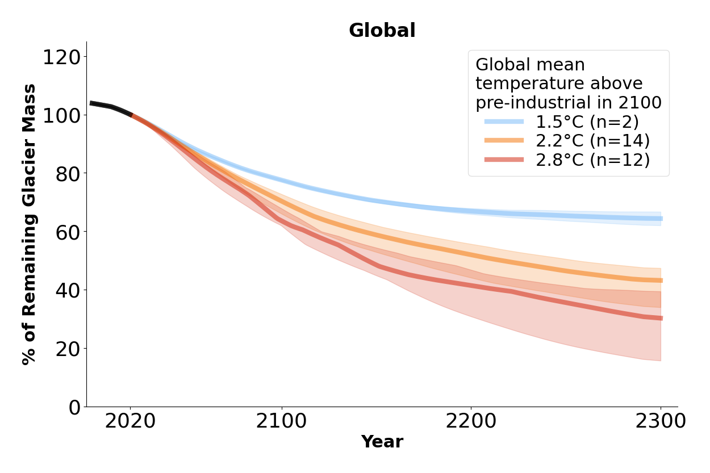
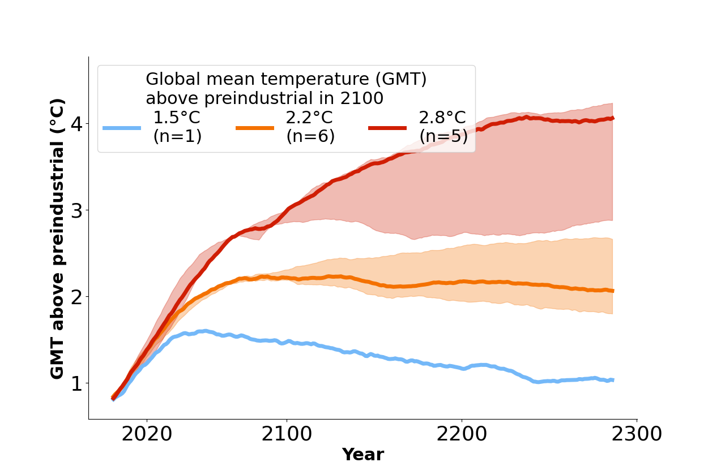
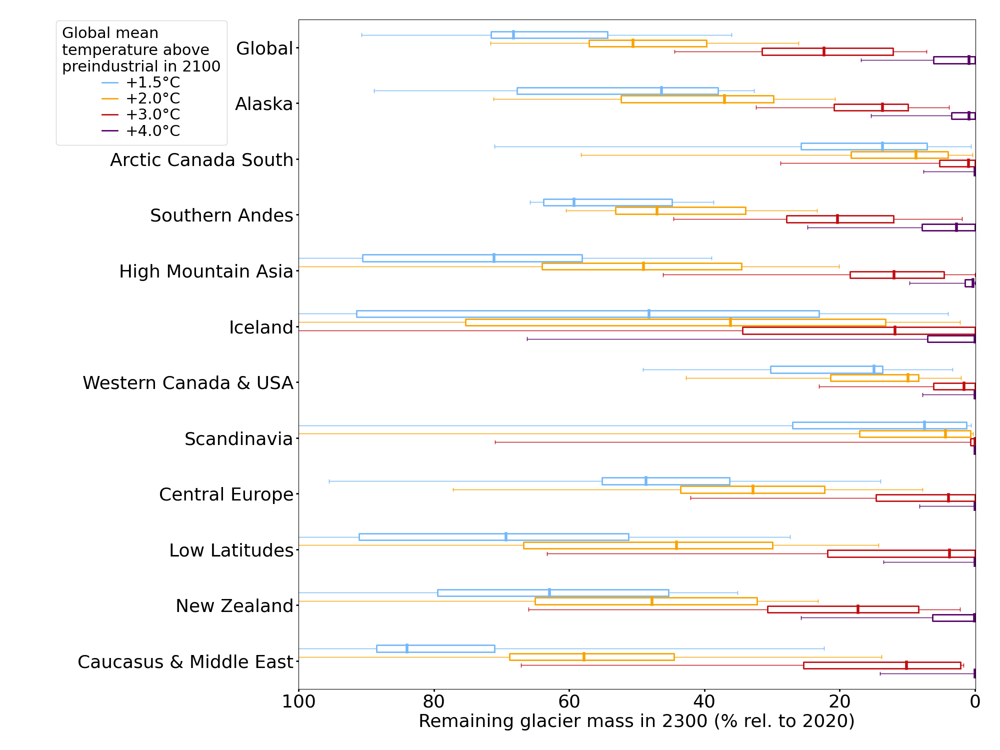

# Glacier model projection figures for the ICCI State of the Cryosphere report 2024

For the ICCI State of the Cryosphere report 2024, we decided to show simplified glacier projection figures that are based on the same underlying glacier model projection data as in the 2023 report figures. 

---

||
|:--:|
|*Figure 1: **Global glacier mass until 2300, relative to 2020**. Black lines denote the past evolution from 2000-2019. The lines show the median and the shading shows the interquartile range (25th to 75th percentile). n corresponds to the amount of experiments (i.e. glacier model projections times amount of climate scenarios). In case of 1.5°C, there is just one climate scenario and just two glacier models that did projections for that climate scenario.*|

In [v2024_figures](v2024_figures/), you can find the figures that cover each region individually, as well as an additional figure for High Mountain Asia (i.e., the combined regions of Central Asia, South Asia West, and South Asia East) in png, pdf and svg format. 

For those familiar with the 2023 figures, please note that the new figures no longer include the LOWESS fit estimates featured in the 2023 ICCI report (see [README.md](README.md) for infos about the LOWESS fit). 

---
***Short description of the new method:*** 
To project glacier mass until 2300, we grouped climate scenarios (combinations of climate models and emission scenarios) into clusters corresponding to global temperature changes of **1.5±0.2°C, 2.2±0.2°C, and 2.8±0.2°C** by 2100 (average 2071-2100). We display the median global temperature for each group. These specific temperature levels (+1.5, +2.2, and +2.8°C) were selected because the median temperature within each ±0.2°C range aligns with the chosen target.

*Small methodological update: For v2024, we use [IPCC AR6](https://www.ipcc.ch/report/sixth-assessment-report-cycle/) rather than the [IPCC SROCC](https://www.ipcc.ch/srocc/) as used in v2023 to estimate past warming between 1850-1900 and 1986-2005. Thus, v2024 assumes a warming of 0.69°C between 1850-1900 and 1986-2005, compared to the 0.63°C warming used in v2023.*

Code for all v2024 figures is available at: [v2024_simplified_visualisation_choice.ipynb.ipynb notebook](v2024_simplified_visualisation_choice.ipynb).
----

The **advantages** of these simplified v2024 figures are that they are cleaner and clearer, with fewer lines, making them easier to understand. 

However, there are also **disadvantages** to this approach, as the simplified figures are less scientifically robust. In these v2024 figures, uncertainties arising from climate model selection are less represented (see Figure 2). For example, there is only one climate scenario combination close to a 1.5°C global temperature change by 2100. Similarly, for the 2.2°C and 2.8°C global temperature change scenarios, only six and five climate scenario combinations are available, respectively.

Furthermore, the chosen climate scenario for the +1.5°C level (CMIP5, MPI-ESM-LR, RCP-2.6) does not stabilize at 1.5°C but rather “overshoots” meaning it initially exceeds 1.5°C and then declines to cooler temperatures after 2100. This results from specific climate model sensitivities and the RCP scenario, leading to global and cooling. Consequently, some fast-responding regions display glacier growth due to this cooling. More information on the influence of temperature overshoots on glaciers can be found under this [pre-print](https://doi.org/10.21203/rs.3.rs-5045894/v1). 

||
|:--:|
|*Figure 2: **Global mean temperature change for the three temperature levels** (climate scenarios within ±0.2°C), calculated using 30-year rolling averages. The lines represent the median temperature change, while the shaded areas indicate the interquartile range (25th to 75th percentile). Here, n corresponds to the number of climate scenarios.*|

---
### Comparison of remaining glacier mass in 2100 between selected regions
To provide an overview of different regions and retain some of the scientific robustness of the LOWESS fit approach, we have created a figure that shows glacier mass projections in 2300 for selected regions. These estimates may differ from the simplified v2024 regional projection figures (such as Figure 1), as they are based on estimates derived from the entire ensemble of climate scenarios using the LOWESS fit.

||
|:--:|
|*Figure 3: **Remaining glacier mass in 2300 for selected regions**. Estimates given by LOWESS fits (see README.md for more information about the LOWESS fit). Boxplots indicate the 5th, 25th, 50th, 75th, and 95th percentiles. IPCC AR6 estimates used for past warming.*|
